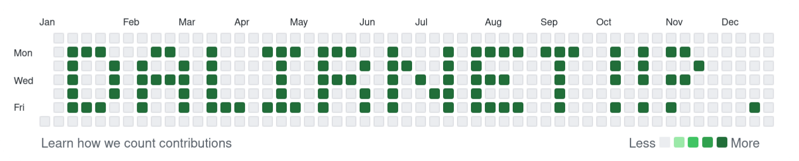

# GitArt

## Fun art with git contributions

### Sample [live](https://github.com/dalirnet?tab=overview&from=2011-12-01&to=2011-12-31)




### Command

-   `--text` `-t`

    -   Text for drawing
    -   Default 'GitArt'

-   `--year` `-y`

    -   Year of commits
    -   Default 2000
    -   Min 2000
    -   Max 2020

-   `--gap` `-g`

    -   Gap from start of year
    -   Default 1
    -   Min 1
    -   Max 45

-   `--cpd` `-c`
    -   Commits per day
    -   Default 1
    -   Min 1
    -   Max 9

### Generate

```bash
# With npm

npx gitart --text 'dalirnet !!??' --year 2011 --gap 1 --cpd 1
```

```bash
# With github

npx github:dalirnet/gitart -t 'dalirnet !!??' -y 2011 -g 1 -c 1
```

```bash
# Output

✔ Generated "DALIRNET !!?  ." at /path/to/GitArts/GitArt2011
```

### Publish

```bash
# Change directory

cd /path/to/GitArts/GitArt2011
```

```bash
# Add remote

git remote add origin https://github.com/user/GitArt2011.git
```

```bash
# Push to remote

git push -u origin main
```
